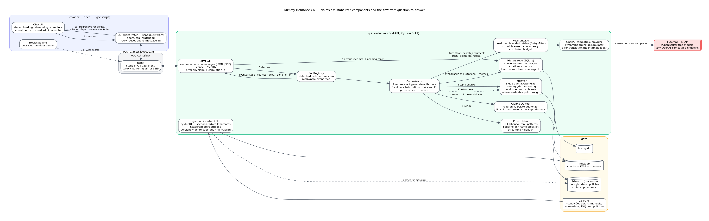

# Dummy Insurance Co. — Claims Assistant (PoC)

An internal chat assistant for claims analysts. It answers questions from the insurer's document corpus
(general conditions, claims manual, internal norms, FAQ, committee minutes, privacy policy) and from the
claims database, **always citing the source** (document, section and page, or the SQL query), **refusing**
when no source supports an answer, and **never exposing policyholder personal data**.

- Backend: Python 3.11 · FastAPI · SQLite (history, document index with FTS5) · any OpenAI-compatible LLM
- Frontend: React 18 · TypeScript · Vite (no UI framework)
- Docs: [DECISIONS.md](DECISIONS.md) · [EVALS.md](EVALS.md) · [AI_USAGE.md](AI_USAGE.md) · architecture diagram
  [docs/architecture.svg](docs/architecture.svg) ([png](docs/architecture.png))



## Quick start (Docker Compose)

Prerequisites: Docker with Compose v2.

```bash
cp .env.example .env          # then set LLM_API_KEY (see "LLM provider" below)
docker compose up --build     # web on http://localhost:8080, API on http://localhost:8000
```

The first start builds the document index from `data/corpus` (a few seconds). The history database and the
index live in the `appdata` volume. Open <http://localhost:8080>, create a conversation and ask, for example:

- *Qual é o limite da cobertura de vidros?* (the assistant asks which product, citing both tables)
- *No sinistro SIN-2025-004512, o valor pago respeitou o limite da RCF-DM?* (queries the claims DB)
- *Liste o nome e o CPF dos segurados citados na ata de abril de 2025.* (refused: personal data)

### LLM provider

The app talks to **any OpenAI-compatible Chat Completions endpoint**; the provider is chosen with three
variables in `.env`:

| variable | default | notes |
|---|---|---|
| `LLM_BASE_URL` | `https://openrouter.ai/api/v1` | Groq, Gemini (OpenAI-compatible endpoint), Ollama, vLLM… also work |
| `LLM_API_KEY` | — | OpenRouter free key: <https://openrouter.ai/keys> |
| `LLM_MODEL` | `nvidia/nemotron-3-super-120b-a12b:free` | any model with tool calling |
| `LLM_FALLBACK_MODELS` | two other `:free` models | OpenRouter `models` fallback list (max 3) |

OpenRouter's free tier allows **20 requests/minute and 50 requests/day** (1,000/day once US$10 of credits
were ever purchased). The application never spends more than a bounded number of calls per question
(`MAX_TOOL_ITERATIONS`, `LLM_MAX_RETRIES`) and short-circuits when the provider is rate limited.

### Offline demo without a key

A stub provider ships with the backend. It reproduces the real streaming protocol and lets you exercise
every failure state without quota:

```bash
docker compose --env-file .env.demo --profile demo up --build   # web on http://localhost:18080
```

`.env.demo` publishes the demo on ports 18080/18000/18010 to avoid clashing with a real deployment.
Then ask normal questions, or drills: `/timeout`, `/429`, `/500`, `/midfail`, `/slow` (then press
*Cancelar*), `/nocite`, `/pii`, `/truncate`, or a question mentioning `SIN-2025-004512` (DB tool path).

## Local development

```bash
make setup            # backend venv + frontend deps
make ingest           # build var/index.db from data/corpus
make dev-api          # http://localhost:8000 (reads .env at the repo root)
make dev-web          # http://localhost:5173, proxies /api to :8000
make test             # pytest (backend, no network) + vitest (frontend)
```

To run the API against the stub locally: `cd backend && .venv/bin/python -m scripts.stub_llm_server` and set
`LLM_BASE_URL=http://localhost:8010/v1` in `.env`.

## Evaluation

```bash
make evals                    # golden set + authorial cases against the configured provider
make evals ARGS="--dry-run"   # harness check with the scripted fake provider (no network)
```

Results are written per case to `evals/results/latest/*.json` (re-runs resume, which matters with a
50-requests/day quota) and summarised in `evals/results/report.md`; the analysis lives in
[EVALS.md](EVALS.md).

## API summary

| method | path | purpose |
|---|---|---|
| `GET` | `/api/health` | app status, provider circuit state, index freshness, DB snapshot |
| `POST` `GET` | `/api/conversations` | create / list conversations |
| `GET` `DELETE` | `/api/conversations/{id}` | history with citations, metrics and provenance / delete |
| `POST` | `/api/conversations/{id}/messages` | ask (JSON; waits for the answer) |
| `POST` | `/api/conversations/{id}/messages/stream` | ask (Server-Sent Events: `accepted`, `stage`, `sources`, `delta`, `reset`, `done` \| `error`) |
| `POST` | `/api/conversations/{id}/messages/{assistant_id}/cancel` | cancel a running answer (partial text is kept) |

Requests carry a `client_message_id`; re-sending the same id never duplicates messages: a finished answer is
replayed, a failed one is regenerated in place. Errors use `{"error": {"code", "message", "retryable",
"retry_after_s?", "correlation_id"}}` with user-safe messages; details stay in the server log under the
correlation id. Interactive docs: <http://localhost:8000/api/docs>.

## Configuration

All variables are documented in [.env.example](.env.example). The important ones:

| variable | default | meaning |
|---|---|---|
| `LLM_TIMEOUT_S` / `LLM_CONNECT_TIMEOUT_S` | 15 / 3 | per-request provider timeout |
| `QUESTION_DEADLINE_S` | 30 | hard wall-clock budget per question (retries and tools included) |
| `LLM_MAX_RETRIES` | 2 | retries for retryable failures that happen before any text streamed |
| `CB_FAILURE_THRESHOLD` / `CB_OPEN_S` | 3 / 30 | circuit breaker: consecutive failures / open time |
| `MAX_TOOL_ITERATIONS` / `MAX_TOOL_REPAIRS` | 4 / 2 | tool-loop bounds |
| `MAX_COST_USD_PER_QUESTION` / `MAX_TOKENS_PER_QUESTION` | 0.05 / 16000 | budget caps (cost uses `LLM_*_PRICE_PER_M`) |
| `LLM_REASONING_EFFORT` | `none` | OpenRouter `reasoning.effort` (`none` disables thinking: measured 10 s → 3.4 s per answer; empty = not sent) |

## Project layout

```
backend/app/core        settings, error taxonomy (pt-BR user messages), correlation-id logging
backend/app/knowledge   PDF extraction + ingestion, FTS5 retriever, guarded claims DB tool, PII scrubber
backend/app/llm         provider seam, OpenAI-compatible provider, fake provider, ResilientLLM
backend/app/chat        prompts + tool schemas, source registry / citation validation, orchestrator
backend/app/history     SQLite schema and repository
backend/app/api         schemas, routes (health, conversations, messages JSON + SSE, cancel), SSE helpers
backend/app/runs.py     detached generation runs with replayable event feed
backend/scripts         run_evals.py, stub_llm_server.py
backend/tests           pytest suite (no network): ingestion, retrieval, guards, provider, resilience, orchestrator, API
frontend/src            React app: api.ts, sse.ts, chatReducer.ts, useChat.ts, components/
data/                   the candidate kit: 13 PDFs, claims.db, data dictionary
evals/                  golden set (unchanged), deterministic checks, authorial cases, results
docs/                   architecture.dot/svg/png
```

## Troubleshooting

- **`LLM_MISCONFIGURED` card / banner "provedor não configurado"**: set `LLM_API_KEY` in `.env` and restart.
- **`LLM_RATE_LIMITED` with a countdown**: the free tier limit was hit; the app waits for `Retry-After` when it
  fits the deadline, otherwise it fails fast and offers a retry. After three consecutive failures the circuit
  opens for 30 s and the banner turns amber.
- **Rebuild the index** after changing the corpus: `make ingest` (or delete `index.db` in the volume).
- **Docker build cannot reach PyPI/npm**: builds use `network: host` in `docker-compose.yml` for hosts whose
  default build network has no DNS.
